# AmericanEagle Test Project Java

[](https://www.java.com/)
[](https://maven.apache.org/)
[](https://testng.org/)
[](https://www.selenium.dev/)
[](https://github.com/features/actions)
[](https://allurereport.org/)

---

Это репозиторий для проекта по автоматизации тестовых сценариев для сайта [American Eagle](https://www.ae.com/us/en) с
использованием UI и API тестов.

**American Eagle** — американская розничная компания по продаже одежды и аксессуаров, со штаб-квартирой в Питтсбурге,
штат Пенсильвания.

## Содержание

- [🛠️ Технологический стек](#-технологический-стек)
- [📈 Тест план](./test_plan.pdf)
- [🚀 Запуск тестов](#-запуск-тестов)
- [⚙️ Запуск в Github Actions](#-запуск-в-github-actions)
- [📊 Allure отчет в Github Actions](#-allure-отчет-в-github-actions)

---

## 🛠️ Технологический стек

<p align="center">
  <a href="https://www.jetbrains.com/idea/" rel="nofollow"></a>
  <a href="https://www.java.com/" rel="nofollow"></a>
  <a href="https://www.selenium.dev/" rel="nofollow"></a>
  <a href="https://rest-assured.io/" rel="nofollow"></a>
  <a href="https://maven.apache.org/" rel="nofollow"></a>
  <a href="https://testng.org/" rel="nofollow">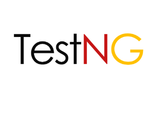</a>
  <a href="https://allurereport.org/" rel="nofollow"></a>
  <a href="https://github.com/" rel="nofollow"></a>
  <a href="https://github.com/features/actions" rel="nofollow"></a>
</p>

- **Язык программирования:** Java 17
- **UI тестирование:** Selenium
- **API тестирование:** REST Assured
- **Сборка:** Maven
- **Тестовый фреймворк:** TestNG
- **Шаблон проектирования:** Page Object Model (POM)
- **Упрощение создания моделей в API тестировании:** Lombok
- **Отчетность:** Allure Report
- **CI/CD:** GitHub Actions, который создаёт Allure отчёт и публикует результаты на GitHub Pages.

**Содержание Allure отчёта:**

- Шаги тестов
- Автоматические скриншоты для упавших UI-тестов (кроме тестов с секретными данными)
- Page Source для упавших UI-тестов

---

## 🚀 Запуск тестов

⛔️ Я тестирую реальный сайт работающего магазина, поэтому некоторые тесты **блокируются защитой от ботов (Akamai)**: не
работают тесты, которые связаны с **авторизацией и регистрацией** на сайте.
В связи с этим в данном проекте эти тесты отмечены тегом "Defect" и для их локального запуска используется отдельная
команда.

### Команды для запуска:

Все тесты (кроме дефектных):

   ```bash     
       mvn clean test       
   ```

Только API-тесты (кроме дефектных):

   ```bash
       mvn clean test -Dsuite=api
   ```

Только UI-тесты (кроме дефектных):

   ```bash
       mvn clean test -Dsuite=ui
   ```

---

## ⚙️ Запуск в Github Actions

1. Перейдите в репозиторий `AmericanEagle`

2. Откройте вкладку `Actions`

<p align="center"> 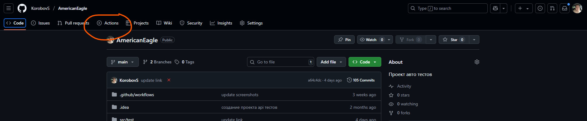 </p>

3. Выберите workflow `Java CI with Maven`

<p align="center"> 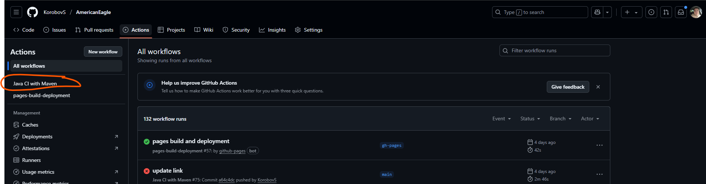 </p>

4. Нажмите `Run workflow`

<p align="center"> 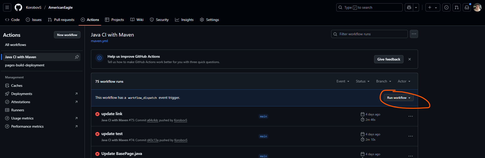 </p>
<p align="center"> 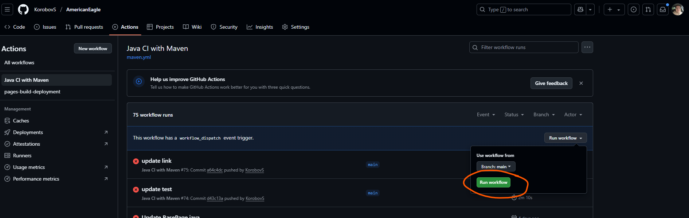 </p>

4. Началось выполнение тестов

<p align="center"> 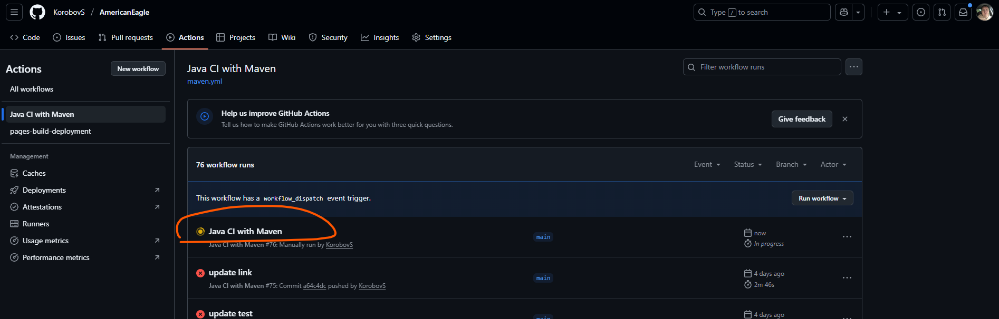 </p>

5. Дождитесь завершения выполнения

---

## 📊 Allure отчет в Github Actions

1. После завершения сборки перейдите в `Actions` снова

<p align="center"> 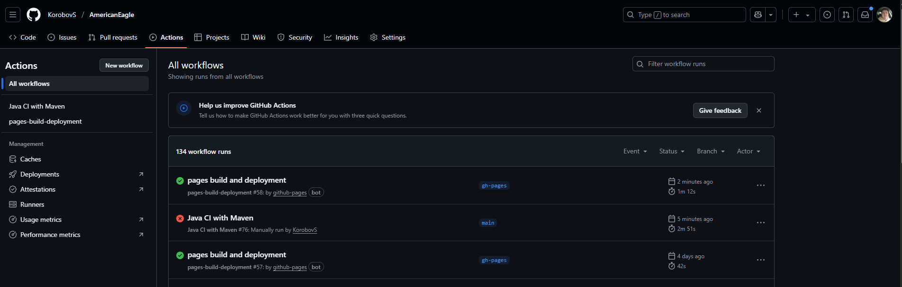 </p>

2. Нажмите на `pages build and deployment`

<p align="center"> 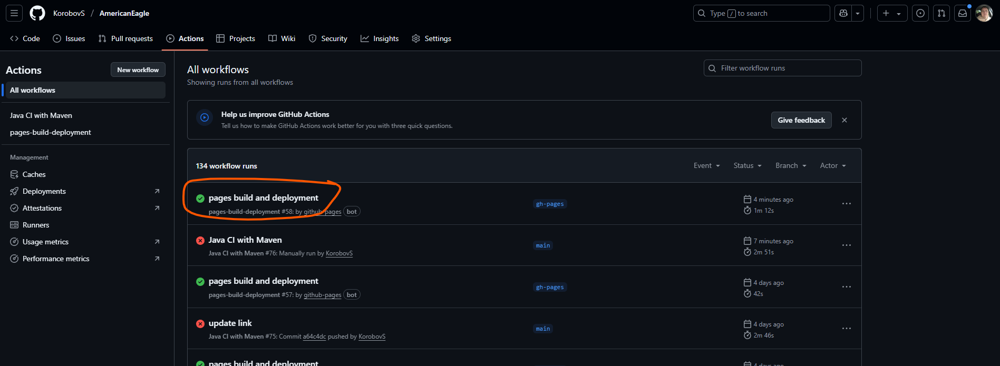 </p>

3. Перейдите по ссылке в отчет

<p align="center"> 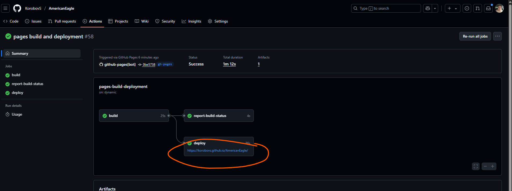 </p>

4. Просмотрите отчет

<p align="center"> 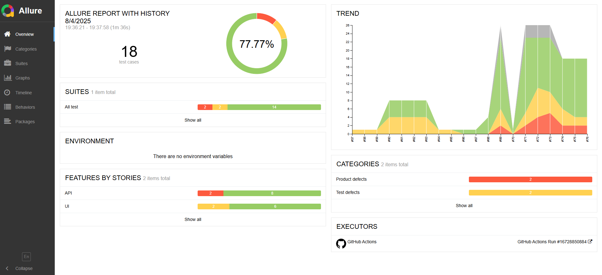 </p>
<p align="center"> 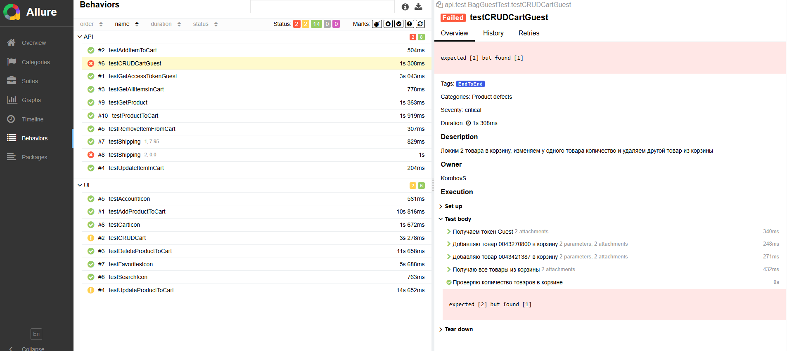 </p>

